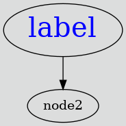

# LuaDot
LuaDot is a Lua module for creating DOT format graph easily.

# Usage
```lua
-- main.lua

local LuaDot = require('./LuaDot')

-- Instanciate new graph whose ID is 'graph_example' and has direction.
-- Can specify graph,node,edge attribute
local graph = LuaDot:new('graph_example',{
  hasDirection = true,
  graphAttribute = {
    bgcolor = "#dcdddd",
    fontcolor = "white",
  },
})

-- Append node with some attribute
graph:appendNode('node1', {
  label = 'label',
  fontcolor = 'blue',
  fontsize = 30
})

graph:appendNode('node2', {})

-- Append edge from node 'node1' to node 'node2'
graph:appendEdge('node1', 'node2')

-- Output DOT format string
print(graph:tostring())
```

```sh
lua main.lua > graph.dot
dot graph.dot -Tpng -o graph.png
```


